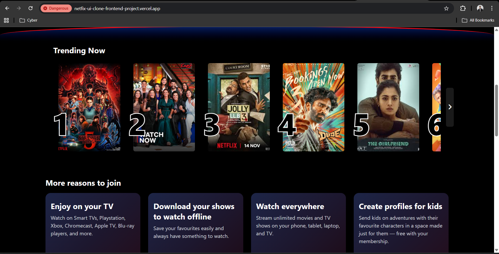
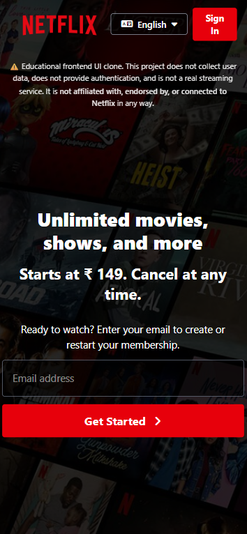
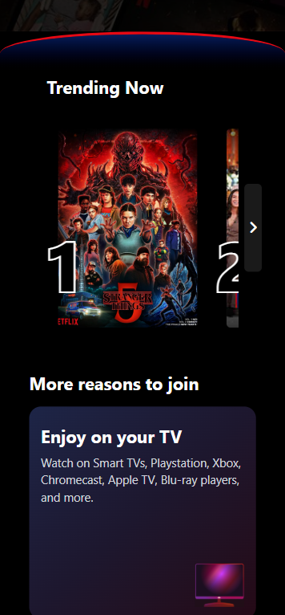

# Netflix UI Clone – Frontend Project

This project is a responsive and interactive **Netflix landing page UI clone**, built using **HTML, Tailwind CSS, and vanilla JavaScript**.

The goal of this project is to practice real-world frontend development concepts such as layout structuring, responsiveness, accessibility, and controlled UI interactions — similar to how production landing pages are built.

---

## 📸 Screenshots

### 🖥 Desktop View

 

### 📱 Mobile View

---

## 🛠 Tech Stack
- HTML5
- Tailwind CSS
- Vanilla JavaScript
- Font Awesome (icons)

---

## ✨ Features
- Netflix-style landing page layout
- Fully responsive design (mobile, tablet, desktop)
- Interactive horizontal carousel with:
  - Smooth scrolling
  - Dynamic left/right navigation visibility
- FAQ accordion with:
  - Smooth open/close animations
  - Keyboard accessibility (Enter / Space)
  - Proper `aria-expanded` state handling
- Semantic HTML and accessibility-friendly markup
- Clean hover and transition effects

---

## ♿ Accessibility
Basic accessibility best practices have been applied:
- FAQ items are keyboard focusable
- Screen readers can detect expanded/collapsed FAQ states
- Interactive elements use appropriate roles and labels

Accessibility was added thoughtfully where it improves usability, without over-complicating the UI.

---

## 🧠 Design & Development Decisions

### Why this is a static UI project
This project focuses purely on **frontend UI and interactions**.  
No backend, authentication, or API integration is included in this version.

The intention is to:
- Build a visually accurate and stable UI
- Keep the codebase simple and readable
- Avoid fake or misleading functionality

---

### Why some features are planned for future versions
Building a product like Netflix is an iterative process.  
Features such as authentication, dynamic data, or backend integration take time and are better added gradually.

Planned future improvements may include:
- Email validation and storage
- Dynamic content rendering
- Backend/API integration
- Framework-based version (React)

This version represents a **solid foundation**, not a finished product.

---

## 📁 Project Structure
/assets → Images & icons
/src
└─ output.css
index.html → Main markup
input.css → styling
script.js → UI interaction logic

---

## 📌 What This Project Demonstrates
- Strong understanding of responsive UI design
- Practical JavaScript for UI state management
- Awareness of accessibility principles
- Ability to make realistic development trade-offs
- Clean and maintainable frontend code

---

## ⚠️ Disclaimer
This project is created for **learning and portfolio purposes only**.  
Netflix is a trademark of Netflix, Inc.

---

## 👤 Author
**Taha Khan**  
Frontend Developer (Learning & Building)
